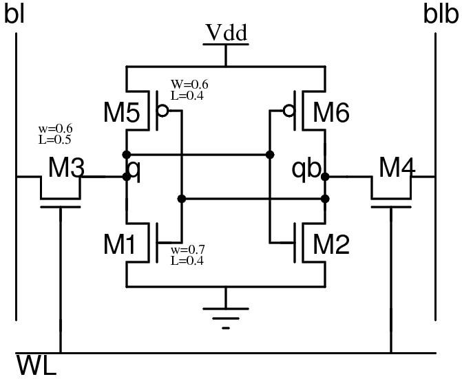
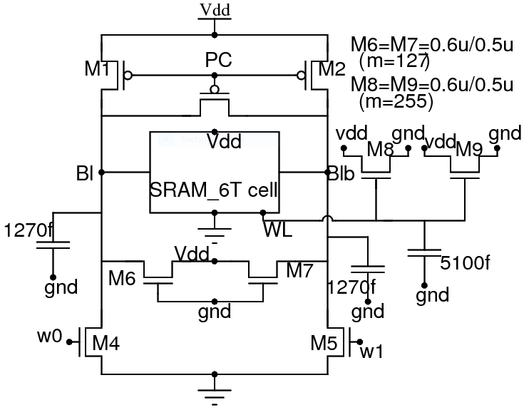

# 6T SRAM

## Table Of Contents

- [Project Details](https://github.com/satyapanda333/6T-SRAM.git#Project-Details)
- [SRAM Design](https://github.com/satyapanda333/6T-SRAM.git#sram-design)
- [Modes Of SRAM Operation](https://github.com/satyapanda333/6T-SRAM.git#modes-of-sram-operation)

- [PreLayout Simulations](https://github.com/satyapanda333/6T-SRAM.git#PreLayout-Simulations)
- [Acknowledgements](https://github.com/satyapanda333/6T-SRAM.git#Acknowledgements)
  
# Project Details
 - **Organisation** : Advance VLSI Lab, [Silicon Institute Of Technology,Bhubaneswar]
 - **Instructors**  : [Prof. Saroj Kumar Rout], [Prof. Santanu Sarangi]
 - **About**        :In this project, we design a novel six-transistor (6T) static random access memory (6T-SRAM) cell for standard applications.
 - **Tools used** : Spice simulation-[NGSpice], Layout design-[Magic], Memory compiler-[OpenRAM]
 - **Technology used**:  MOSIS Scalable CMOS ([SCMOS]):[SCMOS] is a *lambda-based* scalable design rules that can be interfaced to many CMOS fabrication process available at MOSIS.
 - **Typical MOS parameters**:
    - **NMOS**: tox=7.6nm, nch=1.7e17/cm^3, Vt0=0.49V, un(mobility)=445 cm^2/Vs
    - **PMOS**: tox=7.6nm, nch=1.7e17/cm^3, Vt0=-0.66V, up(mobility)=151 cm^2/Vs
    - Vdd=5V, Lmin=0.4um, Wmin=0.6um
    
 - **SRAM Specification** 
	 -  Memory Size --> 1kx32-bit
	 - Technology PDK file --> 0.4um SCMOS Technology from MOSIS
	 -  Operating voltage --> 5V
# SRAM design
Design of a 6T-SRAM cell for minimum area using the 0.5um SCMOS technology.

>**Sizing calculation of 6T-SRAM cell**
>---
This is the calculation for a 6T-SRAM cell for minimum area using 0.5um SCMOS technology.After calculation it is observed that the minimum sizing is possible at 1 volt with W1=0.7u,L1=0.4u,W3=0.6u,L3=0.5u,W5=0.6u,L5=0.4u.

.png)

>**6T-SRAM cell(With minimum area after sizing calculation)**
>---

# Modes Of SRAM Operation
 
> **Hold State**
> ---

- **WORDLINE=0** 
- Access transistors(M3,M4)-OFF
- Bistable operating points
- Previous data stored
 
> **Read Mode**
> ---
 
 
- **WORDLINE=1**
- Access transistors(M3,M4)-ON
- Bitlines Precharged
- Data(Q) to be read
 
> **Write Mode**
> ---
 
- **WORDLINE=1**
- Access transistors(M3,M4)-ON
- Bitline/Bitlinebar=0(According to data-Done by write driver)
- Data(Q) to be flipped/written over previous value
# PreLayout Simulations

## Static Noise Margin(SNM)

The stability of SRAM circuit depends on the Static Noise Margin .This is the maximum amount of voltage noise that can be tolerated at the cross-inverters output nodes without flipping the cell.It can be extracted by calculating the largest possible square in the two voltage transfer characteristic curves (VTC) of the involved CMOS inverters and get us to know how much noise the SRAM Cell can tolerate.

>**HOLD SNM**
>---
The below plot is the plot of VTC of inverter 2 and inverse VTC of inverter 1.As they are connected back to back a two-lobed (butterfly) curve is generated.

>**Read SNM**
>---

As during the read operation the word line is on and bit line ,bit libe bar both charged to vdd the circuit across the access transistors act as a voltage divider and the internal node voltage increases gradually.that leads to the shrinking of the curve.

>**DC analysis**
>---

By doing dc analysis i have checked the performance of the SRAM cell at different Process Voltage Temperature(PVT) corners ranging from -40 degree celsius to 125 degree celsius.
 
## Tabulation

|Process corners|-40|27|125|
|---|---|---|---|
|**SS**|Vq=0.978 Vqb=4.68|Vq=0.978 Vqb=4.72|***Vq=0.956 Vqb=4.77***|
|**NOM**|Vq=0.983 Vqb=4.65|Vq=0.983 Vqb=4.69|Vq=0.962 Vqb=4.75|
|**FF**|Vq=0.998 Vqb=4.59|***Vq=0.999 Vqb=4.63***|Vq=0.980 Vqb=4.70|

From the above tabulation it is observed that the 6T-SRAM cell is fast at process corner FF at 27 degree celsius and slow at process corner SS at 125 degree celsius.

>**Transient analysis**
>---

By transient analysis a circuits response over a period of time is checked.

>** Circuit diagram of 6T-SRAM cell with all parasitics for transient analysis
>---

# Acknowledgements

- Dr.Saroj Rout,Associate Professor,Silicon Institute Of Technology,Bhubaneswar
- Mr.Santunu Sarangi,Assistant Professor,Silicon Institute Of Technology,Bhubaneswar

* * *
[Silicon Institute Of Technology,Bhubaneswar]: https://www.silicon.ac.in/sitbbsr/
[Prof. Saroj Kumar Rout]: https://www.linkedin.com/in/sroutk/
[Prof. Santanu Sarangi]: https://www.linkedin.com/in/santunu-sarangi-b731305b/
[OpenRAM]:              https://openram.soe.ucsc.edu/
[SCMOS]:                https://www.mosis.com/files/scmos/scmos.pdf
[NGSpice]:              http://ngspice.sourceforge.net
[NGSpiceMan]:           http://ngspice.sourceforge.net/docs/ngspice-html-manual/manual.xhtml
[Magic]:                http://opencircuitdesign.com/magic/
[Netgen]:               http://opencircuitdesign.com/netgen/

